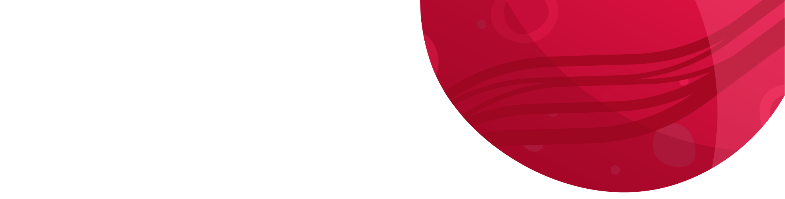

I am also an open-source enthusiast and maintainer. I learned a lot from the open-source community and I love how collaboration and knowledge sharing happened through open-source.

As a Computer Science Student , I am deeply passionate about programming and software development, with a particular focus on web development and front-end technologies.
 
I am also an open-source enthusiast and maintainer. I learned a lot from the open-source community and I love how collaboration and knowledge sharing happened through open-source.

 Ask me about anything, I am happy to help;  
 How to reach me: hichamamaarou@gmail.com  

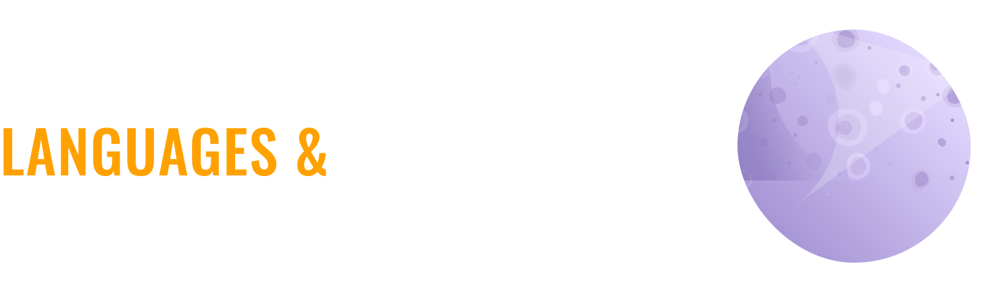

    
    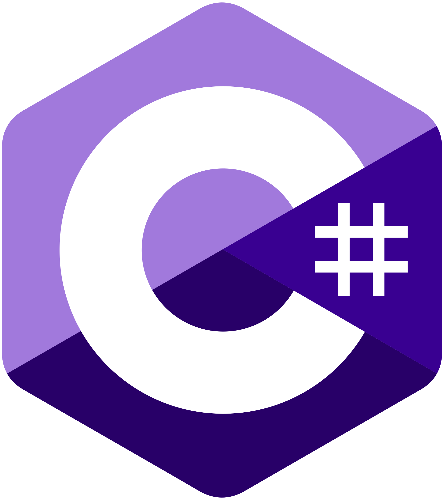
    
    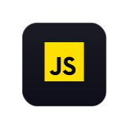
    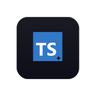
    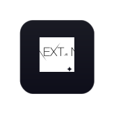
    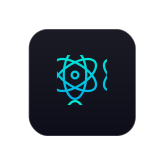
    
    
    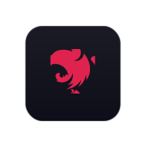
    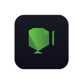
    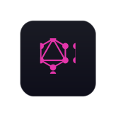
    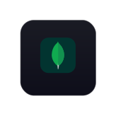
    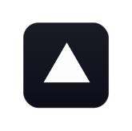
    
    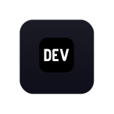
    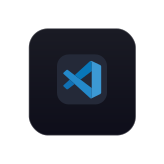
    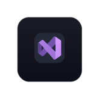
    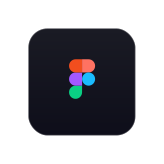

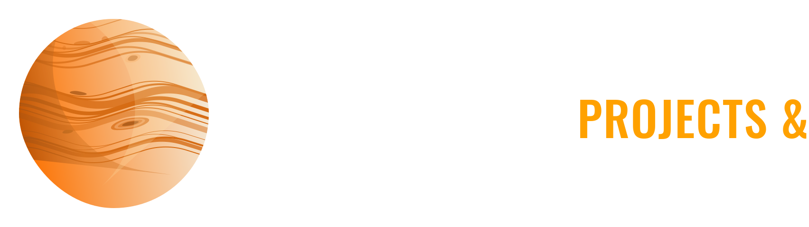

<!-- 

    

 -->

<a href="https://github.com/Hamaarour/So_Long_42">

<a href="https://github.com/Hamaarour/push_swap">
<a href="https://github.com/Hamaarour/minishell">
<a href="https://github.com/Hamaarour/Philosopher">
<a href="https://github.com/Hamaarour/CPP_Modules">

<a href="https://github.com/Hamaarour/Net_Practice">
<a href="https://github.com/Hamaarour/Cub3D_1337">

